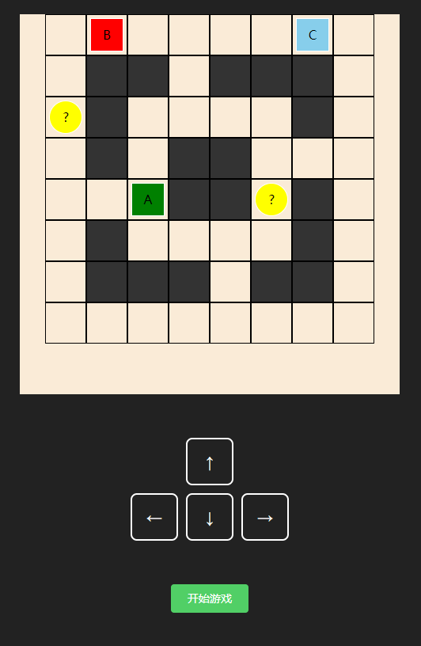
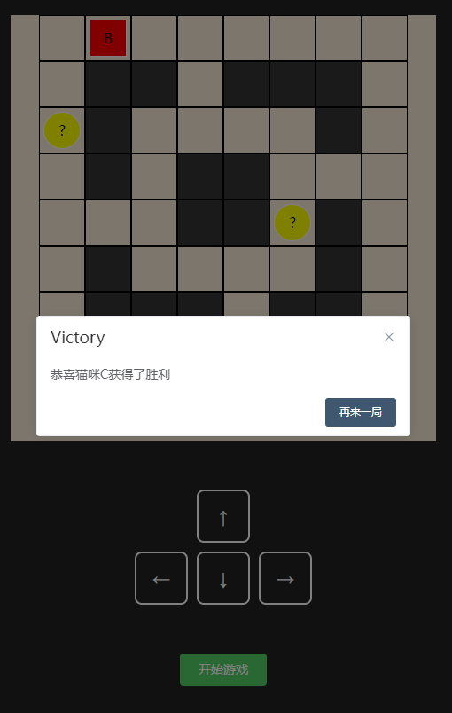

<!--
 * @Author: yanding.li David.Jackson.Lyd@gmail.com
 * @Date: 2023-02-03 20:38:53
 * @LastEditors: yanding.li David.Jackson.Lyd@gmail.com
 * @LastEditTime: 2023-02-04 04:05:17
 * @FilePath: \maze\README.md
 * @Description: 
 * 
 * Copyright (c) 2023 by ${git_name_email}, All Rights Reserved. 
-->
# maze

## 1.Project setup 安装依赖包
```
npm install
```

### 2.Compiles and hot-reloads for development, 本地开发
```
npm run serve
```

### Compiles and minifies for production 打包
```
npm run build
```

### Lints and fixes files 校验lint
```
npm run lint
```

### Customize configuration
See [Configuration Reference](https://cli.vuejs.org/config/).


### 项目截图
## 默认地图配置


## 游戏胜利
